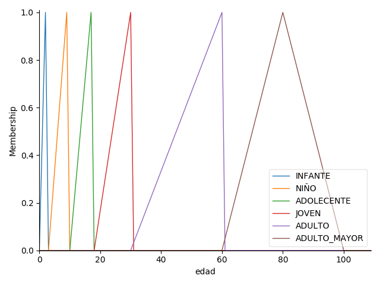
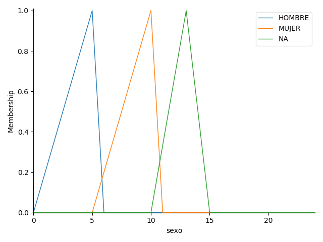
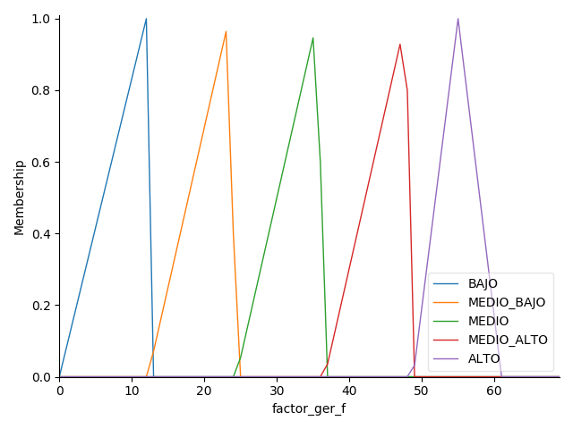
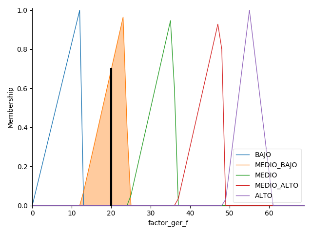

## Sistema de control difuso para el cálculo del GER
### Antecednets (entradas)
- **Edad**
    - Universo (es decir, rango de valores nítidos): ¿Que edad se especifica para el cáculo, en una escala del 1 al 100?
    - Conjunto difuso (es decir, rango de valores difusos): infante, niño, adolecente, joven, adulto, adulto mayor



- **Sexo**
    - Universo: ¿Cual es tu sexo!, en una escala del 0 al 15?
    - Conjunto difuso: hombre(0-5), mujer(5-10), na(10-15)



### Consecuencias (Salidas)
- **Ger**
    - Universo: ¿Valor que debería ser, en una escala de 0 al 61
    - Conjunto difuso: bajo, medio bajo, medio, medio alto, alto




### Reglas
1. Si SEXO es HOMBRE y EDAD es INFANTE entonces FACTOR_GER será ALTO.
2. Si SEXO es MUJER y EDAD es INFANTE entonces FACTOR_GER será ALTO.

3. Si SEXO es HOMBRE y EDAD es NIÑO entonces FACTOR_GER será MEDIO_BAJO.
4. Si SEXO es MUJER y EDAD es NIÑO entonces FACTOR_GER será MEDIO_BAJO.

5. Si SEXO es HOMBRE y EDAD es ADOLESCENTE entonces FACTOR_GER será MEDIO_BAJO.
6. Si SEXO es MUJER y EDAD es ADOLESCENTE entonces FACTOR_GER será BAJO.

7. Si SEXO es HOMBRE y EDAD es JOVEN entonces FACTOR_GER será MEDIO_BAJO.
8. Si SEXO es MUJER y EDAD es JOVEN entonces FACTOR_GER será MEDIO_BAJO.

9. Si SEXO es HOMBRE y EDAD es ADULTO entonces FACTOR_GER será BAJO.
10. Si SEXO es MUJER y EDAD es ADULTO entonces FACTOR_GER será MEDIO_BAJO.

11. Si SEXO es HOMBRE y EDAD es ADULTO_MAYOR entonces FACTOR_GER será MEDIO_BAJO.
12. Si SEXO es MUJER y EDAD es ADULTO_MAYOR entonces FACTOR_GER será BAJO.
### Uso
##### POSTMAN
* Usando el verbo **POST** 
* ENDPONIT http://13.58.250.57:5000/api/nutrition/ger
* BODY
```JSON
{
	"edad": "25",
	"sexo": "5",
	"peso": "80"
}
```
- **Si le digo a este controlador que cálcule :**
    - La edad = 25, y el sexo = Mujer
- **Genera un valor:**
    - **GER:** 2016.


